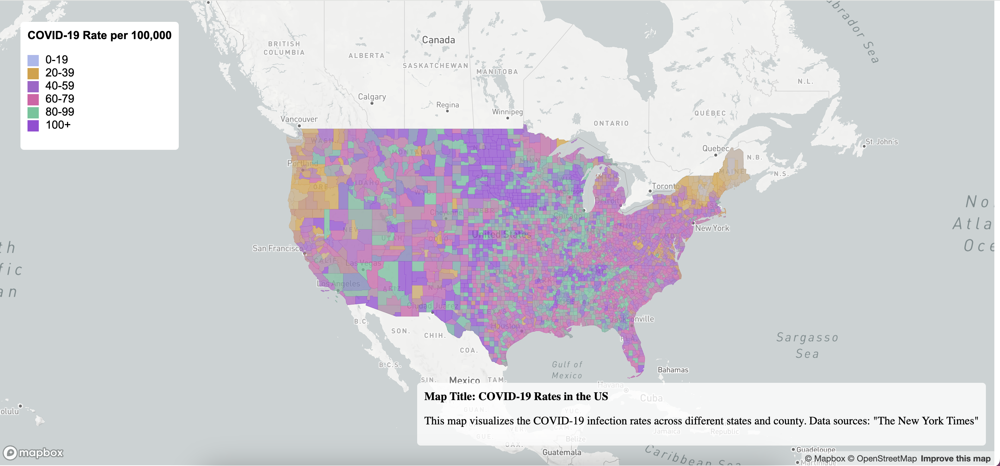
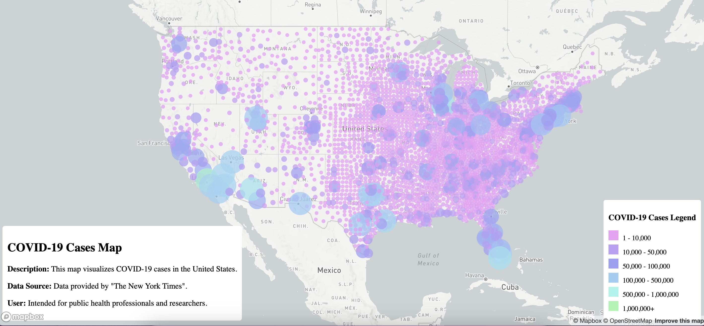

## Map 1: Choropleth Rates Map

### Introduction
This map visualizes COVID-19 infection rates per 100,000 across the United States, showing the state and county levels. The interactive choropleth map provides an overview of the pandemic's impact, highlighting areas with varying infection rates through color gradation.

[Covid-19 Choropleth Rates Map](map1.html)

### Features
- **Interactive Map**: Users can click on any region to see detailed data about COVID-19 rates.
- **Dynamic Legend**: A legend adjusts to reflect the range of data displayed on the map.
- **Data Visualization**: The map uses color gradients to represent different infection rate intervals, making it easy to identify areas with higher or lower rates.

### Primary Function
The primary function involves dynamically sourcing and integrating real-time COVID-19 data from multiple sources, processing it, and updating the map in real-time to reflect current rates.

### Libraries Used
- [Mapbox GL JS](https://www.mapbox.com/mapbox-gljs): For rendering interactive maps.

### Data Sources
COVID-19 data was sourced from:
- The New York Times COVID-19 Data
### Screenshots

## COVID-19 Proportional Symbols Case Map

### Introduction
The COVID-19 Cases Map is an interactive visualization tool designed to display the number of COVID-19 cases across the United States. Utilizing color-coded circles of varying sizes, the map provides an view of the spread and intensity of the pandemic in different parts of the country.

[Covid-19 Proportional Symbols Map](map2.html)

### Features
- **Interactive Circles**: Represent the number of cases in each region and color indicating the case count.
- **Color-Coded Legend**: A legend explains the color scheme, correlating specific colors to case count ranges.
- **Pop-up Information**: Clicking on a circle displays a pop-up with detailed information about the number of cases in that area.
- **Responsive Design**: The map is fully responsive, providing a experience on various devices and screen sizes.

### Primary Function
The primary feature of this map, distinguishing it from other COVID-19 visualizations, is its use of proportional symbols to represent case counts, providing a clear visual differentiation between regions based on the severity of outbreak. This approach allows for an immediate understanding of the pandemic's impact relative to population density and geographic distribution.

### Libraries Used
- [Mapbox GL JS](https://www.mapbox.com/mapbox-gljs): For creating and manipulating the interactive map.

### Data Sources
The data for COVID-19 case counts is sourced from:
- The New York Times COVID-19 Data

### Screenshots
